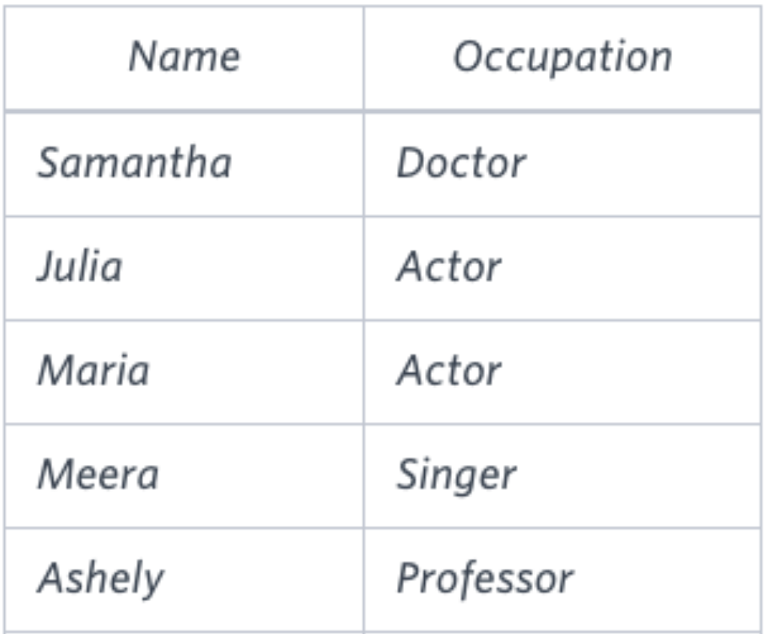
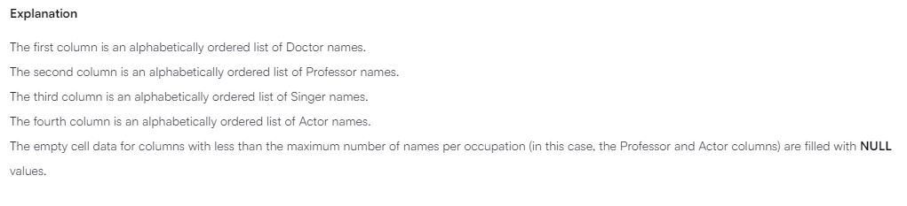

Pivot the Occuparion column in CCCUPATIONS so that
each Nams is sorted alphabetically and displayed its corresponding Occupation.
The output colums headres shoud be Doctor, Professor, Singer and Actorm respectiveely.

Note: Print null when there are no more names correponding to an occupation.

Input format 

Occupation will contains one of the followng values Doctor, Porfessor, Singer or Actor.

Sample Input

Sample output

link 
https://www.hackerrank.com/challenges/occupations/problem?isFullScreen=true