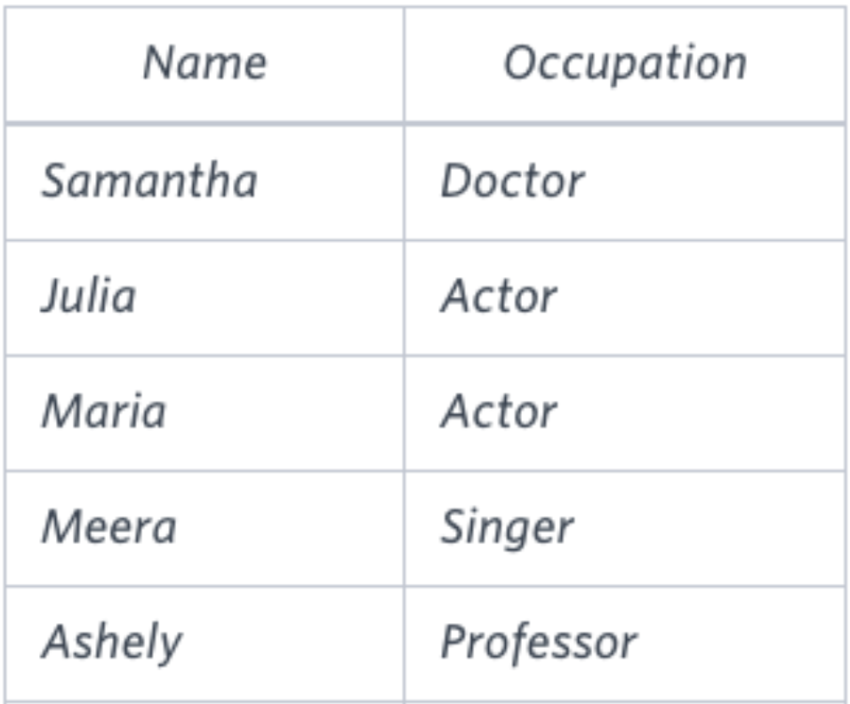

Aqui está o texto formatado para um arquivo Markdown (.md) com descrições em inglês e português:

```md
# Occupation Column Pivot

## Description (English)
Pivot the `Occupation` column in `OCCUPATIONS` so that each `Name` is sorted alphabetically and displayed with its corresponding `Occupation`. The output column headers should be `Doctor`, `Professor`, `Singer`, and `Actor`, respectively.

**Note:** Print `NULL` when there are no more names corresponding to an occupation.

### Input Format


`Occupation` will contain one of the following values: `Doctor`, `Professor`, `Singer`, or `Actor`.

### Sample Input


### Sample Output


[Link to the Challenge](https://www.hackerrank.com/challenges/occupations/problem?isFullScreen=true)

---

## Descrição (Português)
Transponha a coluna `Occupation` em `OCCUPATIONS` para que cada `Name` seja ordenado alfabeticamente e exibido com sua `Occupation` correspondente. Os cabeçalhos das colunas de saída devem ser `Doctor`, `Professor`, `Singer` e `Actor`, respectivamente.

**Nota:** Imprima `NULL` quando não houver mais nomes correspondentes a uma ocupação.

### Formato de Entrada


`Occupation` conterá um dos seguintes valores: `Doctor`, `Professor`, `Singer` ou `Actor`.

### Exemplo de Entrada


### Exemplo de Saída


[Link para o Desafio](https://www.hackerrank.com/challenges/occupations/problem?isFullScreen=true)
```

Esse formato inclui descrições em inglês e português, juntamente com as imagens de exemplo e o link para o desafio no HackerRank.