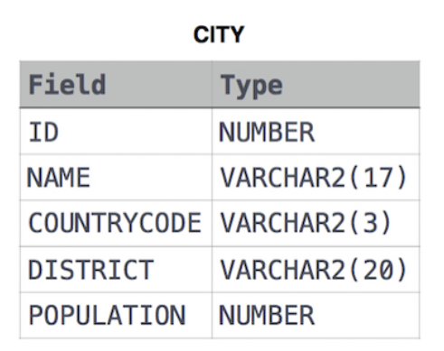

# Query American Cities

## Description (English)
Query the `NAME` field for all American cities in the `CITY` table with populations less than 120000. The country code for America is `USA`.

### Table Description
The `CITY` table is described as follows:

[Link to the Challenge](https://www.hackerrank.com/challenges/revising-the-select-query-2/problem?isFullScreen=true)

---

## Descrição (Português)
Faça uma consulta no campo `NAME` para todas as cidades americanas na tabela `CITY` com populações menores que 120000. O código do país para os Estados Unidos é `USA`.

### Descrição da Tabela
A tabela `CITY` é descrita da seguinte forma:

[Link para o Desafio](https://www.hackerrank.com/challenges/revising-the-select-query-2/problem?isFullScreen=true)
